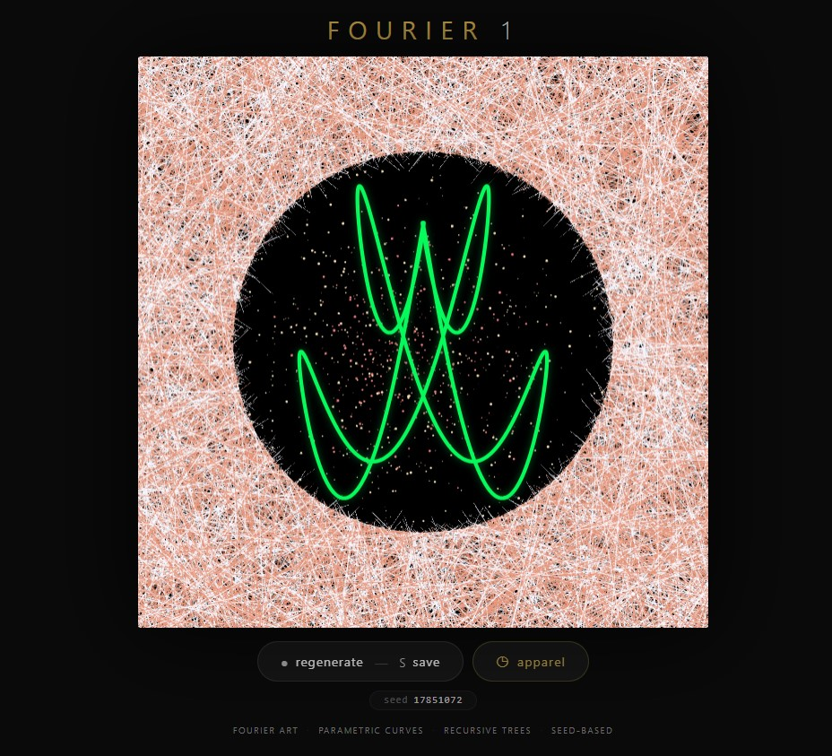
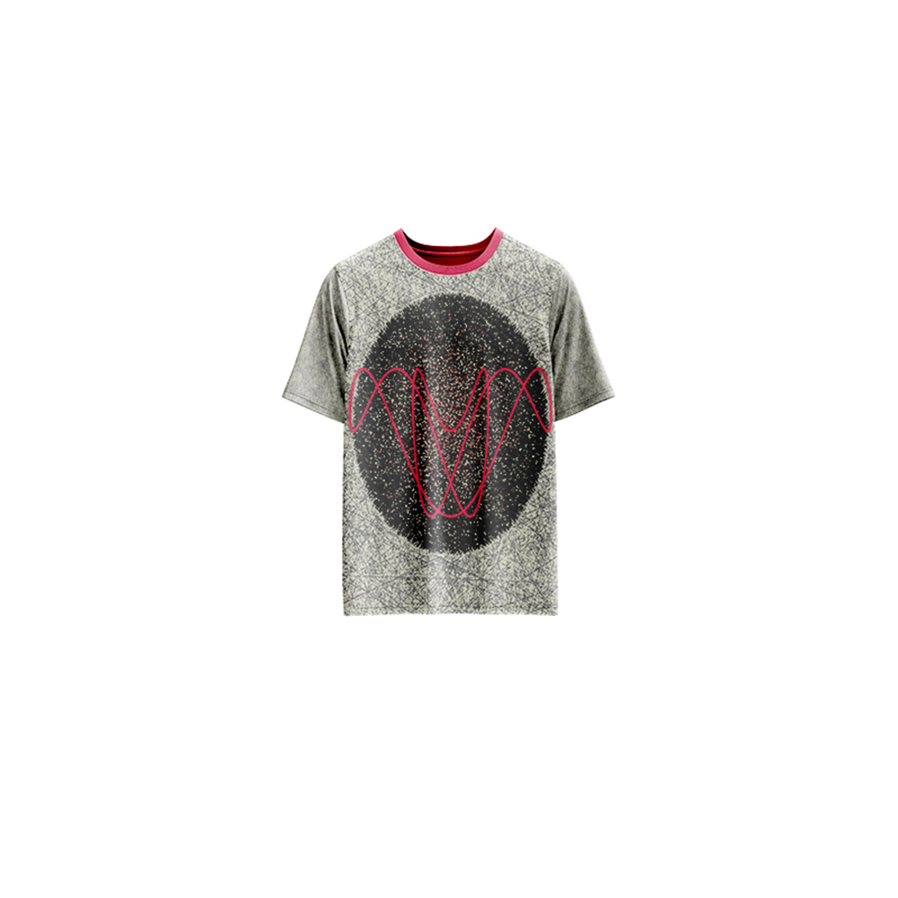

# Fourier 1 — Generative Art

[](https://reyrove.github.io/Fourier-1-Generative-Art)
[](https://opensource.org/licenses/MIT)

> **Generative parametric art with Fourier synthesis.** Each refresh creates a unique composition of recursive trees, parametric curves, and organic patterns inspired by Fourier mathematics.

## 🎨 Live Demo

<div align="center">
  <a href="https://reyrove.github.io/Fourier-1-Generative-Art" target="_blank">
    
  </a>
  <br><br>
  <a href="https://reyrove.github.io/Fourier-1-Generative-Art" target="_blank">
    
  </a>
  <br>
  <em>Click the image or button to experience the generative art</em>
</div>

## 👕 Apparel Preview

<div align="center">
  
  <br>
  <em>Fourier 1 artwork printed on a T-shirt</em>
</div>

## ✨ Features

- **Parametric Curves** — Complex Fourier-based curves with random parameters
- **Recursive Trees** — Organic branching patterns inside circular masks
- **Dual-Layer Composition** — Trees inside circle, branches outside
- **Rich Color Palettes** — 37+ vibrant foreground and background colors
- **Mathematical Beauty** — LCM-based curve periods for complex patterns
- **Seed-Based** — Every composition is unique and reproducible via its seed
- **Save & Share** — Download as PNG with seed in filename
- **Apparel Mode** — Preview artwork on a T-shirt mockup
- **Responsive** — Works on desktop, tablet, and mobile
- **Pure JavaScript** — No external dependencies
- **Keyboard Shortcuts**:
  - `R` — Regenerate
  - `S` — Save image
  - `T` — Toggle apparel view

## 🎨 Artwork Details

| Parameter | Range | Description |
|-----------|-------|-------------|
| **Tree Depth** | 8–12 | Recursive branching depth |
| **Parametric Steps** | 400 | Curve resolution |
| **Foreground Colors** | 9 options | Bright, vibrant colors |
| **Background Colors** | 28+37 options | Rich color palettes |
| **Curve Period** | LCM-based | Complex harmonic patterns |

## 🌀 The Mathematics

### Fourier Synthesis
The parametric curves are generated using Fourier synthesis, where multiple sine and cosine waves with different frequencies and amplitudes combine to create complex, organic shapes.

### Parametric Equations
Each curve is defined by:
```
x(t) = Σ(Ai * sin(t / Fi))
y(t) = Σ(Bi * cos(t / Fi))
```

### Least Common Multiple (LCM)
The curve period is determined by the LCM of the frequency vectors, creating closed, repeating patterns with complex symmetry.

## 🚀 Quick Start

### Local Development

```bash
# Clone the repository
git clone https://github.com/reyrove/Fourier-1-Generative-Art.git

# Navigate to the directory
cd Fourier-1-Generative-Art

# Open in browser
open index.html
# or use a live server
```

### Deploy to GitHub Pages

1. Push to GitHub
2. Go to Settings → Pages
3. Select branch `main` and root folder
4. Your site will be live at `https://reyrove.github.io/Fourier-1-Generative-Art`

## 🧠 How It Works

The artwork is generated using a deterministic random number generator, seeded by timestamp + random noise. Every refresh:

1. **Setup**:
   - Random colors from multiple palettes
   - Random parameters for curves and trees

2. **Tree Generation**:
   - Recursive branching with random sub-branches
   - Circle mask creates circular tree pattern
   - Inverse mask creates outer branch pattern

3. **Parametric Curve**:
   - Fourier synthesis with random frequencies
   - LCM determines curve period
   - Shadow glow effect for depth

4. **Rendering**:
   - Black background
   - Multi-layer composition
   - Rich, vibrant colors

## 📁 File Structure

```
Fourier-1-Generative-Art/
├── index.html          # Main application (all-in-one)
├── Fourier-1.jpg       # T-shirt mockup image
├── fav.svg             # Favicon
├── demo-screenshot.jpg # Website demo screenshot
├── README.md           # This file
└── LICENSE             # MIT License
```

## 🛠️ Tech Stack

- **Pure Vanilla HTML/CSS/JS** — No dependencies
- **Canvas API** — 2D rendering
- **CSS Flexbox/Grid** — Responsive layout
- **GitHub Pages** — Hosting

## 🎯 Interactive Controls

| Action | Keyboard | Button |
|--------|----------|--------|
| Regenerate | `R` | Click "regenerate" |
| Save Image | `S` | Click "regenerate" |
| Toggle Apparel | `T` | Click "apparel" |

## 🎨 The Creative Process

### Parametric Curves
The curves are generated using Fourier synthesis with random parameters:
- Random frequencies (1-7)
- Random amplitudes (0-2)
- LCM-based period for closed curves
- Creates organic, flowing shapes

### Recursive Trees
Trees grow with random branching patterns:
- 8-12 levels of recursion
- Random number of sub-branches (1-6)
- Circle mask creates contained pattern
- Inverse mask creates outer branches

### Color Palettes
Three color palettes combine:
- **Bright Colors**: Vibrant foreground colors
- **Rich Colors**: Deep, saturated colors
- **Soft Colors**: Pastel and light colors

## 📱 Responsive Design

The application automatically adapts to:
- Desktop screens
- Tablets
- Mobile phones
- Landscape orientation
- Various aspect ratios

## 🤝 Contributing

Contributions are welcome! Feel free to:
- Fork the repository
- Create a feature branch
- Submit a pull request

### Ideas for Contributions:
- New curve equations
- Additional color palettes
- Animation features
- Interactive controls
- Performance optimizations

## 📄 License

MIT License — see [LICENSE](LICENSE) file for details.

## 🙏 Acknowledgments

- Inspired by Fourier analysis and parametric curves
- Pure JavaScript implementation
- Special thanks to the creative coding community

---

**Built with ❤️ and Fourier harmony**